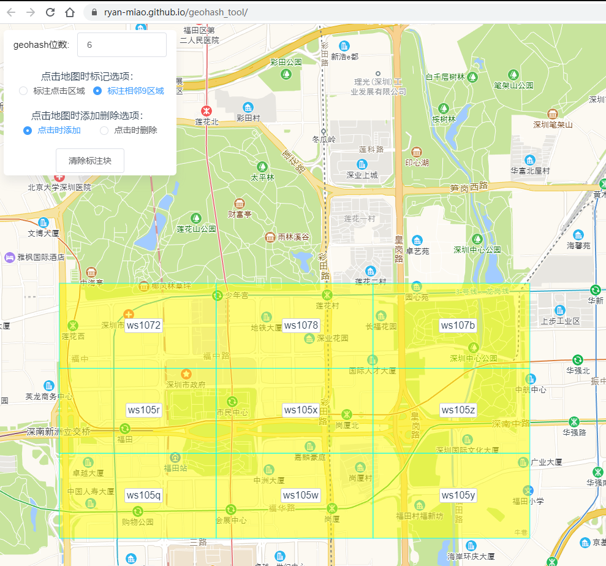
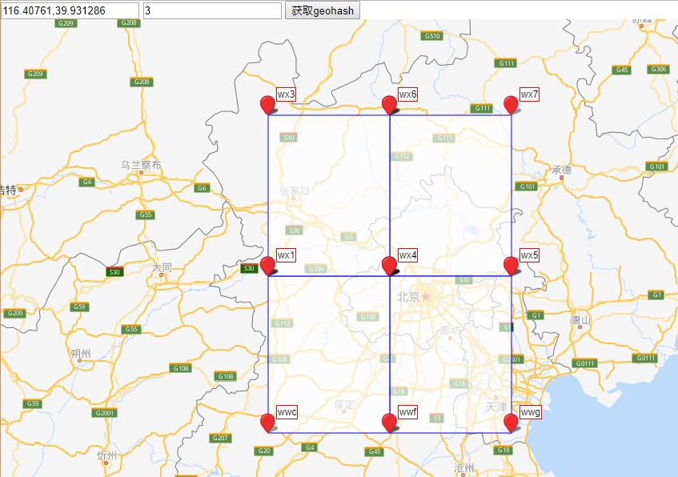
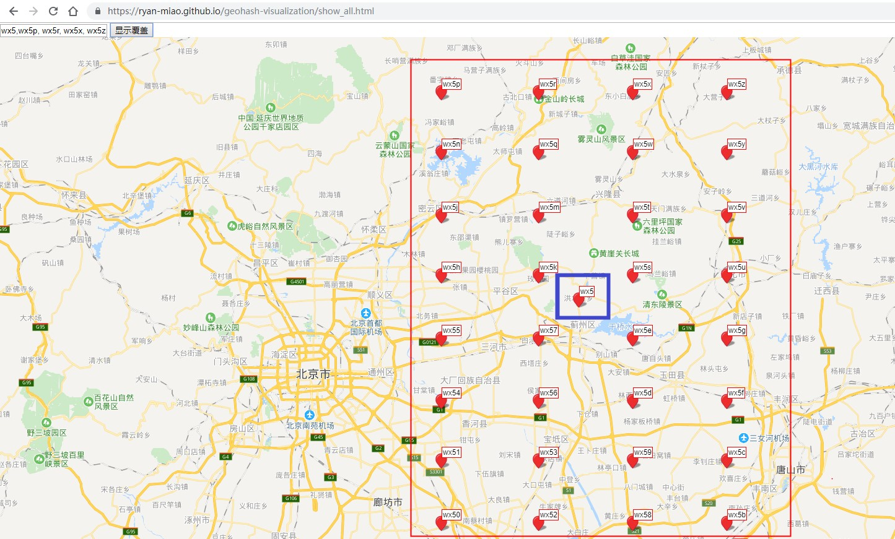

geohash可视化显示
================

经纬度获取9宫格覆盖：
https://ryan-miao.gitee.io/geohash_tool/

geohash坐标定位：
https://ryan-miao.github.io/geohash-visualization/show_all.html

演示了中心点以及周围其他下一级的点的关系

更多查表的原理： https://zhuanlan.zhihu.com/p/39817945

本项目使用的geohash-js:  https://github.com/chrisveness/latlon-geohash

